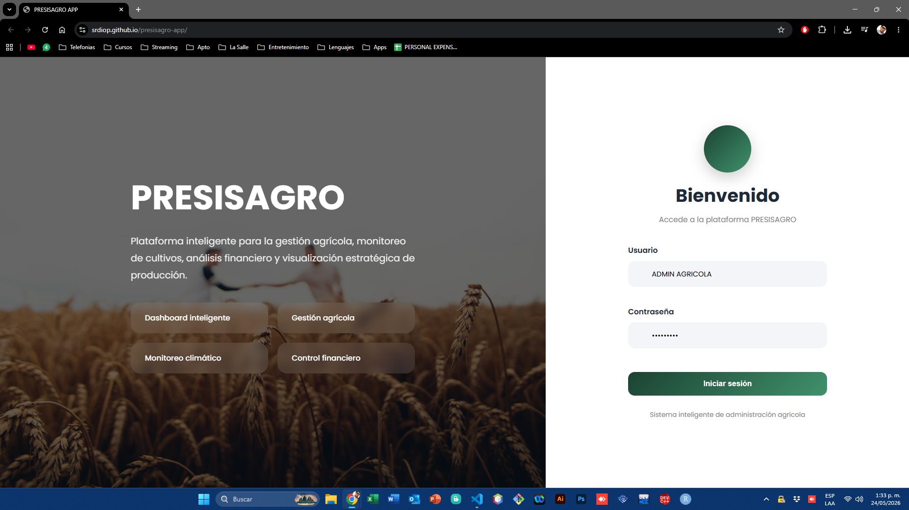
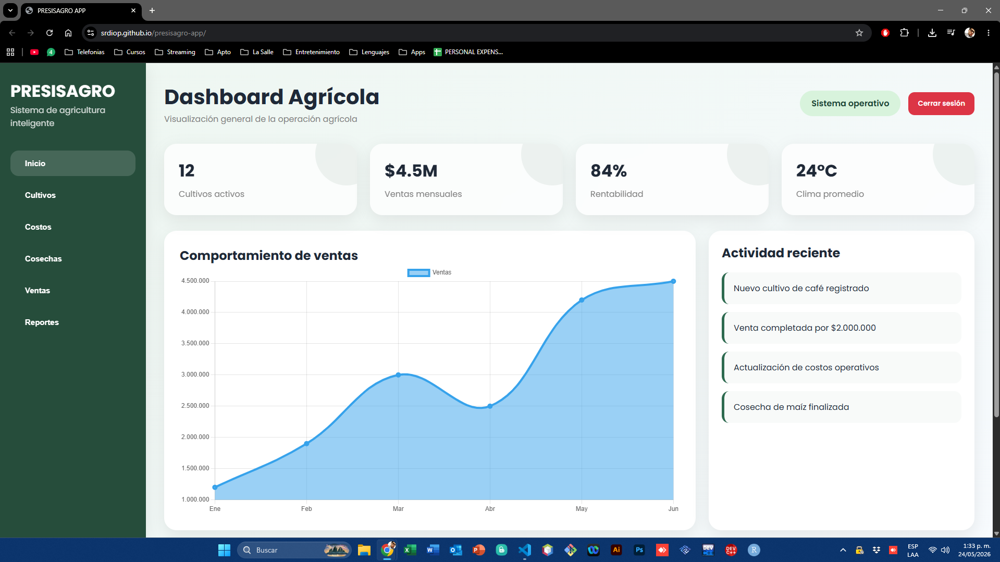
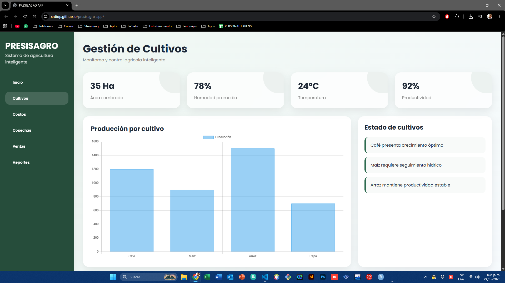
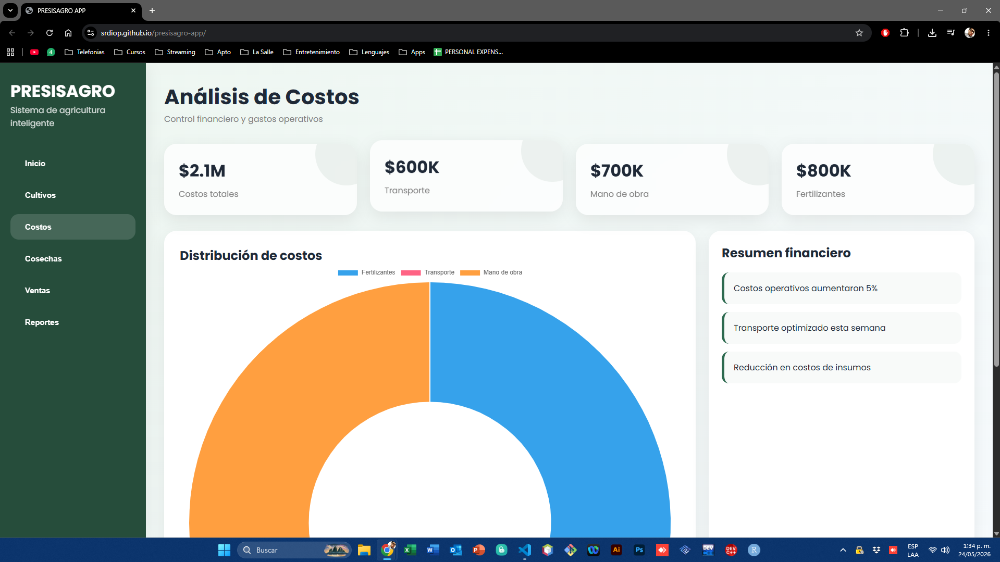
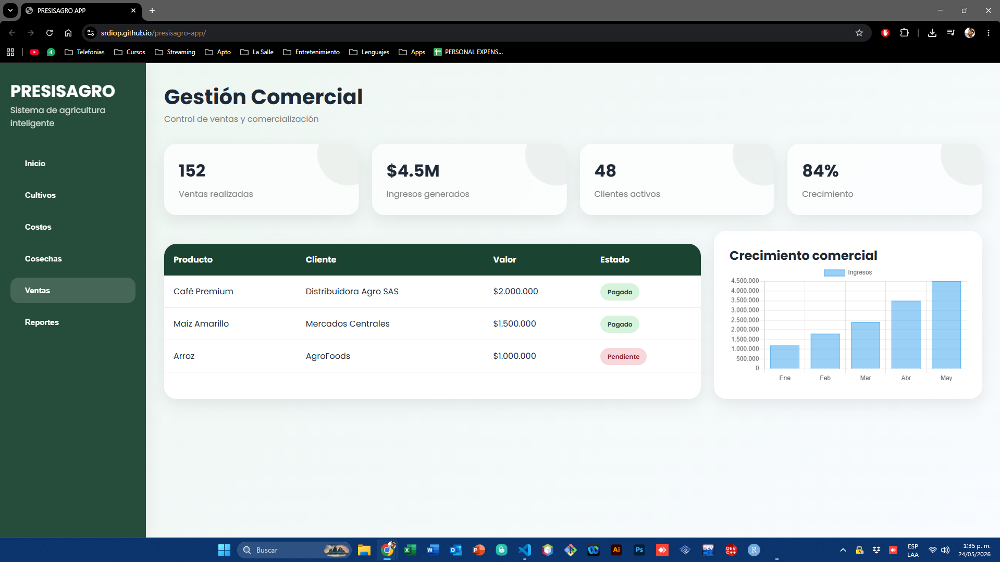
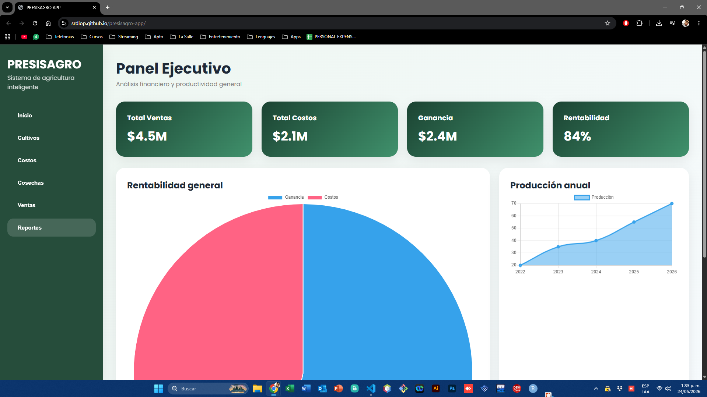

# 🌱 PRESISAGRO APP

Sistema inteligente de gestión agrícola desarrollado bajo principios de Diseño Centrado en el Usuario (DCU).

---

# 📌 Descripción del Proyecto

PRESISAGRO APP es una plataforma web interactiva enfocada en la administración y monitoreo de procesos agrícolas mediante herramientas visuales, dashboards inteligentes y análisis de información estratégica.

El sistema fue diseñado aplicando principios de experiencia de usuario (UX/UI) y Diseño Centrado en el Usuario (DCU), buscando ofrecer una navegación intuitiva, moderna y funcional.

---

# 🎯 Objetivo

Desarrollar un prototipo web funcional que permita optimizar la gestión agrícola mediante visualización de datos, monitoreo de cultivos y control administrativo.

---

# 🖥️ Tipo de Interfaz

✅ Interfaz Web

---

# 🎨 Diseño Centrado en el Usuario (DCU)

Durante el desarrollo del proyecto se implementaron principios de DCU enfocados en:

- Navegación intuitiva
- Diseño visual moderno
- Jerarquía visual organizada
- Accesibilidad visual
- Interacción amigable
- Optimización de experiencia de usuario
- Visualización clara de información
- Facilidad de navegación

---

# 🔐 Características Principales

## Login Interactivo

- Pantalla de acceso moderna
- Simulación de autenticación
- Transiciones visuales
- Función de cerrar sesión

## Dashboard Inteligente

- KPIs agrícolas
- Indicadores visuales
- Gráficas dinámicas
- Actividad reciente
- Estado general de operación

## Gestión de Cultivos

- Monitoreo agrícola
- Seguimiento de productividad
- Visualización de estados
- Indicadores de rendimiento

## Gestión de Costos

- Control financiero
- Distribución de gastos
- Indicadores económicos
- Análisis operativo

## Gestión de Cosechas

- Seguimiento de producción
- Línea de tiempo de recolección
- Indicadores de eficiencia

## Gestión Comercial

- Control de ventas
- Clientes activos
- Seguimiento de pagos
- Crecimiento comercial

## Reportes Ejecutivos

- Rentabilidad
- Producción anual
- Indicadores estratégicos
- Análisis general

---

# 📊 Funcionalidades Implementadas

✅ Dashboard principal interactivo  
✅ Navegación lateral dinámica  
✅ Sistema de login y logout  
✅ Gráficas estadísticas con Chart.js  
✅ Tablas dinámicas  
✅ Indicadores KPI  
✅ Diseño responsive  
✅ Animaciones visuales  
✅ Interfaz moderna UX/UI  
✅ Experiencia interactiva

---

# 🛠️ Tecnologías Utilizadas

- HTML5
- CSS3
- JavaScript
- Chart.js
- Font Awesome
- Google Fonts

---

# 📱 Características UX/UI

- Diseño responsive
- Animaciones suaves
- Navegación intuitiva
- Dashboard visual
- Componentes visuales interactivos
- Experiencia moderna
- Interfaz amigable

---

# 🧪 Métodos de Evaluación Aplicados

Durante el desarrollo del prototipo se implementaron métodos de evaluación orientados a validar la experiencia del usuario y la funcionalidad del sistema:

- Evaluación de usabilidad
- Validación de navegación
- Observación de interacción
- Revisión visual de interfaz
- Pruebas funcionales
- Retroalimentación de experiencia de usuario

---

# 🔄 Etapas del Proyecto

## 1. Investigación

Identificación de necesidades relacionadas con la gestión agrícola y administración de información.

## 2. Diseño UX/UI

Construcción de una interfaz moderna e intuitiva enfocada en experiencia de usuario.

## 3. Prototipado

Desarrollo de un prototipo web interactivo y funcional.

## 4. Evaluación

Validación de usabilidad, navegación y experiencia visual.

---

# 📂 Estructura del Proyecto

```bash
PRESISAGRO/
│
├── index.html
├── styles.css
├── script.js
└── README.md
```

---

# 🚀 Despliegue

El proyecto fue desplegado mediante GitHub Pages.

---

# 👨‍💻 Autor

Diego Rojas González  
Estudiante de Ingeniería de Software

---

# 📚 Proyecto Académico

Proyecto desarrollado con fines académicos aplicando conceptos de:

- Diseño Centrado en el Usuario (DCU)
- UX/UI
- Prototipado Web
- Desarrollo Frontend
- Evaluación de Interfaces

---

# ⭐ Estado del Proyecto

✅ Prototipo funcional finalizado

---

# 📸 Vista del Sistema

## 🔐 Login



---

## 📊 Dashboard Principal



---

## 🌾 Gestión de Cultivos



---

## 💰 Gestión Financiera



---

## 🛒 Gestión Comercial



---

## 📈 Reportes Ejecutivos


